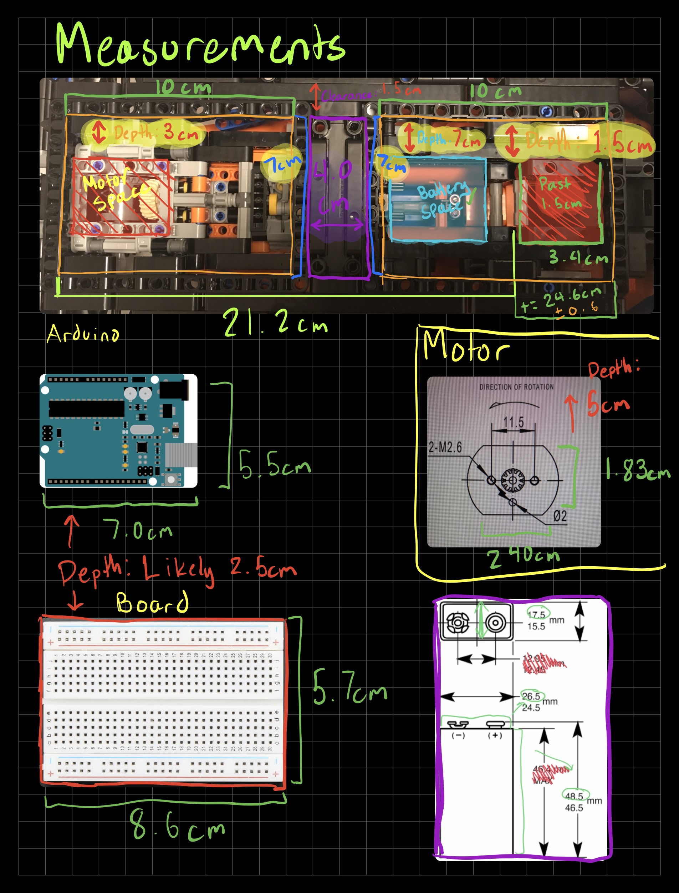
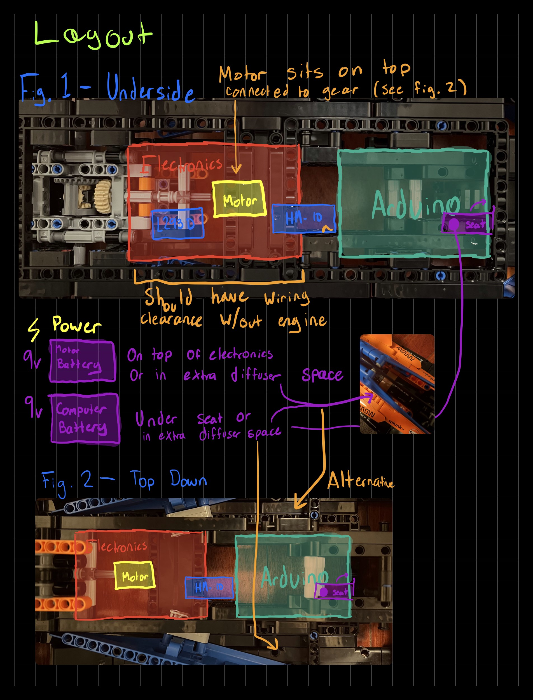

# Driving a Lego McLaren F1 Car


## Table of Contents
- [Driving a Lego McLaren F1 Car](#driving-a-lego-mclaren-f1-car)
  - [Table of Contents](#table-of-contents)
  - [✅ Goals](#-goals)
  - [🪛 Materials](#-materials)
    - [Electronics](#electronics)
    - [Chassis](#chassis)
    - [Control](#control)
  - [🛠️ Construction](#️-construction)
    - [Planning](#planning)
    - [Modifying the body](#modifying-the-body)
    - [Designing parts](#designing-parts)
      - [The motor connector](#the-motor-connector)
      - [Motor holder](#motor-holder)
    - [Finished Product](#finished-product)
  - [⚡ Circuitry](#-circuitry)
  - [🎮 Control System](#-control-system)
    - [Code explanation](#code-explanation)
  - [🏔️ Challenges](#️-challenges)
    - [Learning](#learning)
    - [Ordering parts](#ordering-parts)
    - [Designing Custom Parts](#designing-custom-parts)
    - [Interfacing](#interfacing)
  - [🔧 Improvements](#-improvements)
    - [Motor Torque/Power](#motor-torquepower)
    - [Motor Placement](#motor-placement)
    - [Adding steering](#adding-steering)
  - [🎥 Demo Video](#-demo-video)
  - [Acknowledgements](#acknowledgements)

## ✅ Goals
- Learn computer/electrical engineering concepts
    - Learn how circuits work
- Use an Arduino practically
    - Use a motor driver to interface with a DC motor
- Create my own circuit diagrams
- Modify the Lego body to fit electrical systems
    - Design custom 3D printed parts to interface with motor
    - Design parts to fit electrical systems inside car
- Interface control system with a controller
    - Either using a phone or a game controller
- Manage the project organization

---

## 🪛 Materials
### Electronics
- Arduino Uno
- L293D Motor Driver
- Breadboard
- 2 x 9 volt batteries
- 2 x 9 volt battery snap connectors
- Arduino DC Motor
- HM-10 Bluetooth Module
- Wires (for connections)

### Chassis
- Lego Mclaren F1 Car
- DC Motor to Lego Axle Connector (Custom Designed)
- Motor holder (Custom Designed)

### Control
- iPhone with ArduinoBlue app installed

---

## 🛠️ Construction
### Planning
The two back wheels of the car are connected and both driven by one axle in the center of the car, so by connecting a motor to the axle, the cars back wheels can turn. The diagram below shows the approximate measurements of the body of the car and the planned areas for each component to be placed. 





### Modifying the body
By removing the engine from the car, it frees up space for the DC motor to be connected to the main axle, which drives the two back wheels of the car. Extra platforming was also added to the underbody to allow for the Arduino and breaboard to sit. This was all done using normal Lego Technic parts.


### Designing parts
#### The motor connector
The gear-axle connector is designed to interface the DC motor with the main axle of the car. The technical diagram below shows the part in detail. [View the STL file.](documentation/models/Lego%20Motor%20Connector%20v10.stl)


#### Motor holder
The motor holder is designed to keep the motor in one place so that just the gear-axle system rotates. It interfaces perfectly with basic lego technic connector pieces and allows for wiring and the gear to pass through. [View the STL file.](documentation/models/Motor%20Holder%20v5.stl)

/// HOLDER techdraw

### Finished Product


---

## ⚡ Circuitry
This is the Fritzing diagram showcasing the layout of the circuit. For more power, the L293D motor driver supports up to a voltage of 36 volts.


Using two batteries allowed for a single motor battery as well as an Arduino battery since the DC motor burns through batteries very quickly.

---

## 🎮 Control System
The HM-10 module allows the Arduino to connect with an iPhone using the ArduinoBlue app. See [Acknowledgements](#acknowledgements) for more information.

### Code explanation
The `main.cpp` file contains the source code for controlling the motor using the ArduinoBlue app. The code is fairly simple but was a good introduction to using PIO and integrating a development environment with real hardware.

This section defines the necessary libraries and sets up the pin layout.
```cpp
#include <Arduino.h>
#include <ArduinoBlue.h>
#include <SoftwareSerial.h>

// Motor pins
const int enablePin = 11; // PWM
const int in1 = 10;
const int in2 = 9;

// HM-10 pins
const int txPin = A5;
const int rxPin = A4;

SoftwareSerial bluetooth(tx, rx); // Assign HM-10 Pins
ArduinoBlue phone(bluetooth); // Reference bluetooth object
```


These 3 functions define the motor direction and will be used based on the throttle.
```cpp
// Configures the motor controller to stop the motors.
void brake() {
	digitalWrite(in1, LOW);
	digitalWrite(in2, LOW);
	digitalWrite(enablePin, LOW);
}

// Configures the motor controller to move forward.
void motorSetForward() {
	digitalWrite(in1, HIGH);
	digitalWrite(in2, LOW);
}

// Configures the motor controller to move backwards.
void motorSetBackward() {
	digitalWrite(in1, LOW);
	digitalWrite(in2, HIGH);
}
```


This function gets the throttle input from the phone and sets the motor direction using the previous functions. It also maps the throttle speed to work with the analog pin inputs.
```cpp
void controlDrive() {
  // Throttle values
	// 50 = max forward throttle
	// 0 = no throttle
	// -49 = max reverse throttle

  throttle = phone.getThrottle() - 49;

  if (throttle == 0) { brake(); }
  else if (throttle > 0) { motorSetForward(); }
  else { motorSetBackward(); }
}

void mapSpeed(int throttleValue) {
  throttleSpeed = map(abs(throttleValue), 0, 50, 0, 255);
  // Map speed from phone -49 to 50 (negative doesn't apply since direction is set before)
}
```

This function runs on start and assigns pin values and starts the connection between the HM-10 module and the bluetooth device.
```cpp
void setup() {
  // Set motor control pins to output
  pinMode(enablePin, OUTPUT);
  pinMode(in1, OUTPUT);
  pinMode(in2, OUTPUT);

  // Initial state - off
  digitalWrite(in1, LOW);
  digitalWrite(in2, LOW);

  Serial.begin(9600);
  bluetooth.begin(9600);
}

```

Finally, this function runs continously on the Arduino to write the speed to the motor as well as change the direction of the motor.
```cpp
void loop() {
  controlDrive();
  mapSpeed(throttle);

  analogWrite(enablePin, throttleSpeed);
}
```
---

<!-- https://sites.google.com/stonybrook.edu/arduinoble
https://github.com/purwar2016/ArduinoBlue-library/releases -->
## 🏔️ Challenges
### Learning
Learning how electrical and computer circuits work was challenging but using the Arduino Starter kit helped. After that, I also had to learn how create circuit diagrams using Fritzing, which was fairly straightforward. Finally, I had to learn how to use Fusion360 to design 3D parts, which had a learning curve but after a few hours, I figured it out. Fusion360 is an incredibly useful tool and I'd like to do more with it in the future.

### Ordering parts
Finding a reliable source for parts was very difficult, especially since the quality of parts from somewhere like Amazon is questionable. Some parts also took a while to arrive.

### Designing Custom Parts
Creating parts on such a small scale was difficult because measurements were hard to get precise even with calipers. I often resorted to using published diagrams of lego pieces or motors for precise measurements. I was lucky enough to be able to print parts at my school and it took a few tries to get the measurements just right. Prints aren't always precise to the exact millimeter was was difficult when working on a small scale.

### Interfacing
The hardest part of this project was figuring out how to connect the Arduino to a controller. The first implementation was going to use a USB host shield and a bluetooth dongle to connect to a PS4 controller, however I couldn't find a reliable USB host shield to buy. I then settled on trying to connect to my phone, however iOS uses the BLE protocol, so a device like a HC-05 or HC-06 wouldn't work either. Finally, I found the HM-10 module but then had to find a reliable app to connect with.

---

## 🔧 Improvements
### Motor Torque/Power
The Arduino DC motor that is given with the starter package is very low power and low torque. It can only use a maximum of 6 volts and does not generate enough torque to move the car faster than a few centimeters per second on hardwood floor. There are two possible improvements that could be made. Firstly, a higher torque motor would certainly help. Secondly, more powerful batteries such as A23's would also be beneficial. Unfortunately, these are both difficult due to space concerns but it's something to think about.

### Motor Placement
It's also possible the the motor isn't in the right spot to generate the maximum amount of torque. Orginally, I planned to interface the motor with the gears of the axle using a toothed gear which may have been a better decision.

### Adding steering
Using a servo motor and interfacing with the steering wheel through another custom part is possible. The wiring might be a little difficult but it is something that could be done in the future.

---

## 🎥 Demo Video
// Add video

---

## Acknowledgements
[This article](https://lastminuteengineers.com/l293d-dc-motor-arduino-tutorial/) was especially helpful in learning how the L293D motor driver worked.

The **ArduinoBlue** library was essential to making this project function. 
- https://sites.google.com/stonybrook.edu/arduinoble
- https://github.com/purwar2016/ArduinoBlue-library/releases
