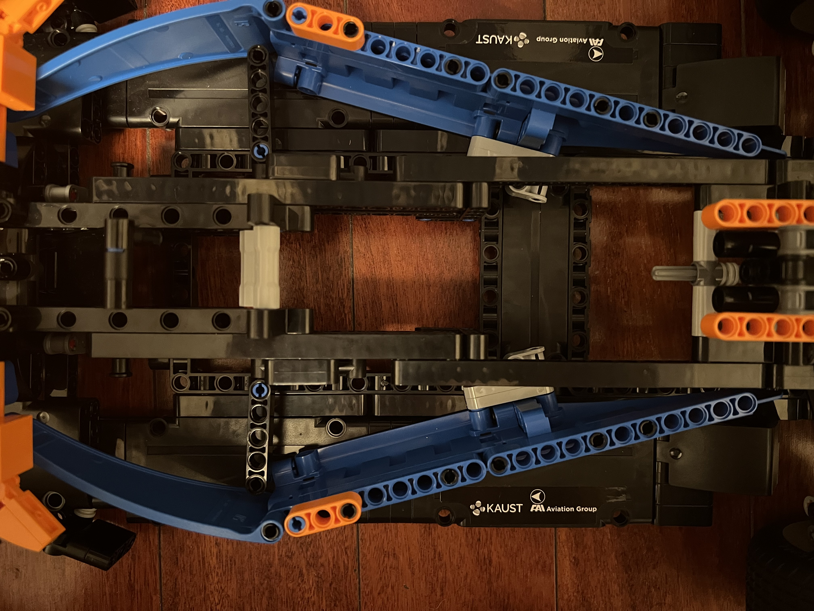
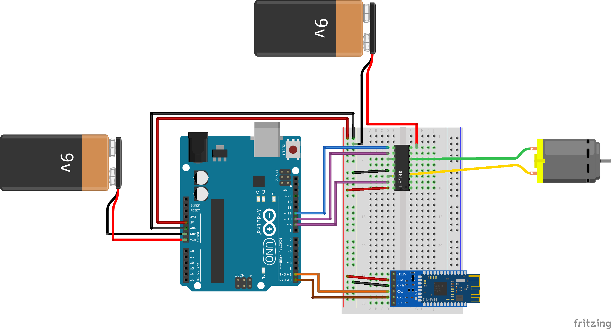
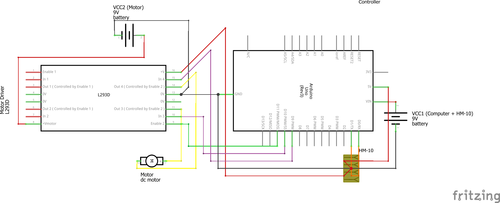

# Driving a Lego McLaren F1 Car


Making a Lego McLaren F1 Car drive using an Arduino Uno and DC motor.


## Table of Contents
- [Driving a Lego McLaren F1 Car](#driving-a-lego-mclaren-f1-car)
  - [Table of Contents](#table-of-contents)
  - [Goals](#goals)
  - [Materials](#materials)
    - [Electronics](#electronics)
    - [Chassis](#chassis)
    - [Control](#control)
  - [Construction](#construction)
    - [Planning](#planning)
    - [Modifying the body](#modifying-the-body)
    - [Designing parts](#designing-parts)
      - [The motor connector](#the-motor-connector)
      - [Motor holder](#motor-holder)
      - [Arduino holder](#arduino-holder)
    - [Finished Product](#finished-product)
  - [Circuitry](#circuitry)
  - [Control System](#control-system)
    - [Code explanation](#code-explanation)
  - [Challenges](#challenges)
    - [Learning](#learning)
    - [Ordering parts](#ordering-parts)
    - [Designing Custom Parts](#designing-custom-parts)
    - [Interfacing](#interfacing)
  - [Acknowledgements](#acknowledgements)

## Goals
- Learn computer/electrical engineering concepts
    - Learn how circuits work
- Use an Arduino practically
    - Use a motor driver to interface with a DC motor
- Create my own circuit diagrams
- Modify the Lego body to fit electrical systems
    - Design custom 3D printed parts to interface with motor
    - Design parts to fit electrical systems inside car
- Interface control system with a controller
    - Either using a phone or a game controller
- Manage the project organization


## Materials
### Electronics
- Arduino Uno
- L293D Motor Driver
- Breadboard
- 2 x 9 volt batteries
- 2 x 9 volt battery snap connectors
- Arduino DC Motor
- HM-10 Bluetooth Module
- Wires (for connections)

### Chassis
- Lego Mclaren F1 Car
- DC Motor to Lego Axle Connector (Custom Designed)
- Motor holder (Custom Designed)
- Arduino holder (Custom Designed)

### Control
- iPhone with ArduinoBlue app installed


## Construction
### Planning
The two back wheels of the car are connected and both driven by one axle in the center of the car, so by connecting a motor to the axle, the cars back wheels can turn. The diagram below shows the approximate measurements of the body of the car and the planned areas for each component to be placed. 


### Modifying the body
By removing the engine from the car, it frees up space for the DC motor to be connected to the main axle, which drives the two back wheels of the car.


### Designing parts
#### The motor connector
The gear-axle connector is designed to interface the DC motor with the main axle of the car. The technical diagram below shows the part in detail.


#### Motor holder

#### Arduino holder

### Finished Product


## Circuitry
This is the Fritzing diagram showcasing the layout of the circuit. For more power, the L293D motor driver supports up to a voltage of 36 volts.




## Control System
The HM-10 module allows the Arduino to connect with an iPhone using the ArduinoBlue app.

### Code explanation
The `main.cpp` file contains the source code for controlling the motor using the ArduinoBlue app.

This section defines the necessary libraries and sets up the pin layout.
```cpp
#include <Arduino.h>
#include <ArduinoBlue.h>
#include <SoftwareSerial.h>

// Motor pins
const int enablePin = 11; // PWM
const int in1 = 10; // PWM
const int in2 = 9; // PWM

// HM-10 pins
const int tx = 1;
const int rx = 0;

SoftwareSerial bluetooth(tx, rx); // Assign HM-10 Pins
ArduinoBlue phone(bluetooth); // Reference bluetooth object
```


These 3 functions define the motor direction and will be used based on the throttle.
```cpp
// Configures the motor controller to stop the motors.
void brake() {
	digitalWrite(enablePin, LOW);
	digitalWrite(in1, LOW);
	digitalWrite(in2, LOW);
	digitalWrite(enablePin, HIGH);
}

// Configures the motor controller to move forward.
void motorSetForward() {
	digitalWrite(in1, LOW);
	digitalWrite(in2, HIGH);
}

// Configures the motor controller to move backwards.
void motorSetBackward() {
	digitalWrite(in1, HIGH);
	digitalWrite(in2, LOW);
}
```


This function gets the throttle input from the phone and sets the motor direction using the previous functions. It also maps the throttle speed to work with the analog pin inputs.
```cpp
void controlDrive() {
  throttle = phone.getThrottle() - 49;

  if (throttle == 0) {
    brake();
    return;
  }
  else if (throttle > 0) { motorSetForward(); } // Forward
  else { motorSetBackward(); } // Backward

  throttleSpeed = map(abs(throttle), 0, 50, 0, 255); // Map speed from phone -49 to 50 (negative doesn't apply since direction is set before)
}
```

Finally, this function runs continously on the Arduino to write the speed to the motor as well as change the direction of the motor.
```cpp
void loop() {
  controlDrive();
  analogWrite(enablePin, throttleSpeed);
}
```


<!-- https://sites.google.com/stonybrook.edu/arduinoble
https://github.com/purwar2016/ArduinoBlue-library/releases -->
## Challenges
### Learning
Learning how electrical and computer circuits work was challenging but using the Arduino Starter kit helped. After that, I also had to learn how create circuit diagrams using Fritzing, which was fairly straightforward. Finally, I had to learn how to use FreeCAD to design 3D parts, which had a learning curve but after a few hours, I figured it out.

### Ordering parts
Finding a reliable source for parts was very difficult, especially since the quality of parts from somewhere like Amazon is questionable. Some parts also took a while to arrive.

### Designing Custom Parts
Creating parts on such a small scale was difficult because measurements were hard to get precise with just a tape measure. I often resorted to using published diagrams of lego pieces or motors for precise measurements. Finding a place to print the parts with precision was also challenging.

### Interfacing
The hardest part of this project was figuring out how to connect the Arduino to a controller. The first implementation was going to use a USB host shield and a bluetooth dongle to connect to a PS4 controller, however I couldn't find a reliable USB host shield to buy. I then settled on trying to connect to my phone, however iOS uses the BLE protocol, so a device like a HC-05 or HC-06 wouldn't work either. Finally, I found the HM-10 module but then had to find a reliable app to connect with.


## Acknowledgements
[This article](https://lastminuteengineers.com/l293d-dc-motor-arduino-tutorial/) was especially helpful in learning how the L293D motor driver worked.

The **ArduinoBlue** library was esential to making this project function. 
- https://sites.google.com/stonybrook.edu/arduinoble
- https://github.com/purwar2016/ArduinoBlue-library/releases
